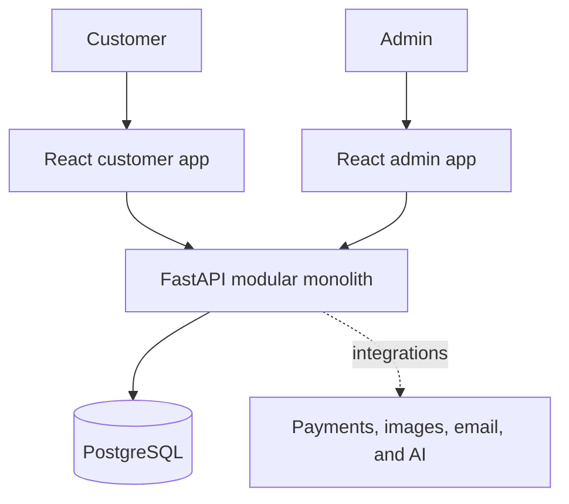
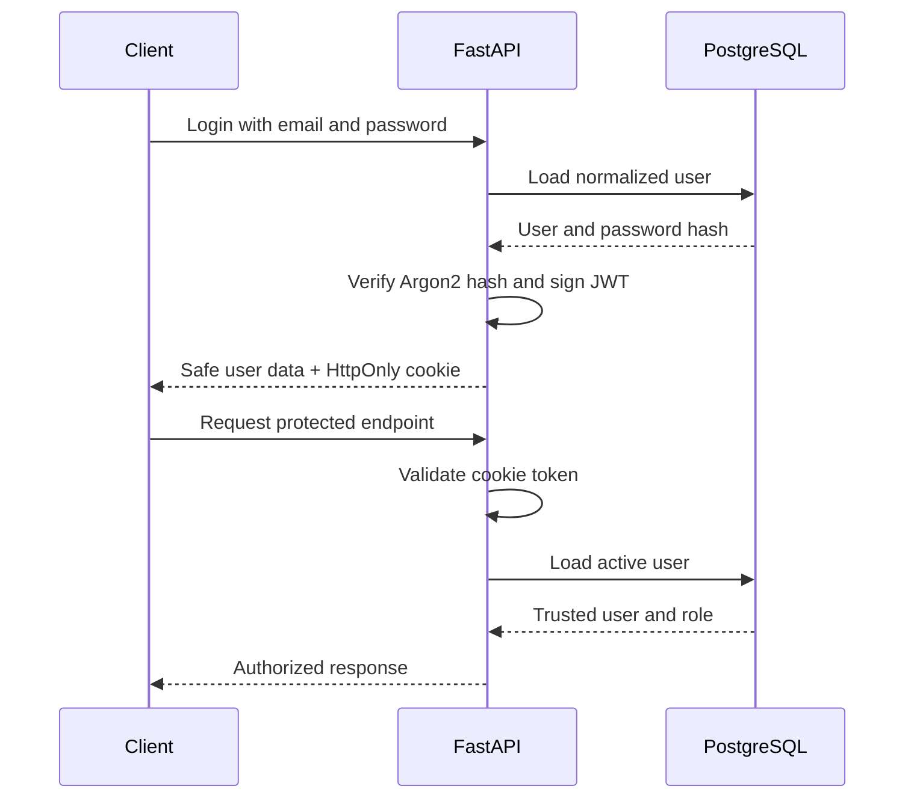

# DeskCraft

> **Build a workspace that works for you.**


DeskCraft is a full-stack e-commerce platform for ergonomic workspace products, designed for students, developers, freelancers, remote workers, and home-office users.

I am building it as a five-month, production-oriented portfolio project to demonstrate full-stack product development with React, TypeScript, FastAPI, PostgreSQL, automated testing, and CI. The project follows a structured roadmap from requirements and system design through implementation, deployment, and production hardening.

## Reviewing this project from LinkedIn?

Here is the fastest way to understand what DeskCraft demonstrates:

| Area | Evidence in the project |
| --- | --- |
| Backend development | Modular FastAPI application, async SQLAlchemy, Alembic migrations, layered feature modules, and REST APIs |
| Authentication and security | Argon2 password hashing, JWT validation, HttpOnly cookies, role-based authorization, and safe error responses |
| Database design | PostgreSQL schemas, entity relationships, constraints, migrations, and isolated test database workflows |
| Code quality | Ruff linting and formatting, pytest integration tests, and GitHub Actions CI |
| Frontend development | Separate React + TypeScript customer and admin applications with a shared design direction |
| System design | Frozen MVP scope, modular-monolith architecture, API conventions, operational endpoints, and documented engineering decisions |
| Product thinking | Customer/admin journeys, inventory-aware recommendations, payments, fulfilment, and deliberate scope control |

## Current status

DeskCraft is under active development.

### Implemented

- Product requirements, customer personas, frozen v1 scope, and delivery roadmap
- Modular-monolith architecture and repository design
- Entity models, ER diagrams, data dictionaries, and API conventions
- FastAPI application factory, configuration, PostgreSQL connection, and async database sessions
- Alembic migration baseline and user/role migration
- Health, readiness, version, and root endpoints
- Request logging and standardized API error responses
- User registration with validation, normalization, duplicate checks, and Argon2 hashing
- Login using signed JWT access tokens stored in HttpOnly cookies
- Current-user authentication and customer/admin authorization
- Safe, idempotent logout behavior
- Authentication integration-test foundation using pytest, HTTPX, and PostgreSQL
- Ruff quality checks and a GitHub Actions backend CI workflow

### In progress

- Customer application foundation with React, TypeScript, and Vite
- Backend test-environment and CI hardening

### Planned for v1

- Customer catalogue, search, filtering, product details, and variants
- Cart, addresses, checkout, Razorpay test payments, and orders
- Shipment tracking and order history
- Admin dashboard, catalogue, inventory, order, shipment, and payment management
- Inventory-aware AI workspace recommendation assistant
- Docker-based local environment, deployment, monitoring, backups, and production hardening

## Architecture

DeskCraft uses a **modular monolith**: one deployable backend organized into clear business modules. This keeps v1 understandable and maintainable while preserving boundaries that can evolve later if scale requires it.



PostgreSQL is the source of truth. Redis and Celery are planned later for caching and background jobs where they provide a clear benefit.

## Technology stack

| Layer | Technologies |
| --- | --- |
| Customer and admin apps | React, TypeScript, Vite, shadcn/ui |
| Backend | Python, FastAPI, Pydantic |
| Data | PostgreSQL, async SQLAlchemy, asyncpg, Alembic |
| Authentication | pwdlib with Argon2, PyJWT, HttpOnly cookies |
| Testing and quality | pytest, HTTPX, Ruff |
| CI | GitHub Actions |
| Planned integrations | Razorpay, Cloudinary, email, OpenAI, Redis, Celery |

## Backend design

Features are grouped by business capability rather than by one global technical layer.

```text
backend/app/
├── api/
├── core/
├── db/
├── middleware/
└── modules/
    ├── users/
    └── auth/
```

A feature module may contain:

```text
models/
schemas/
repository.py
service.py
routes.py
dependencies.py
```

The normal request path is:

```text
Route → Schema validation → Service → Repository → SQLAlchemy → PostgreSQL
```

- **Routes** handle HTTP concerns such as status codes, cookies, and responses.
- **Schemas** validate input and control safe output.
- **Services** enforce business rules.
- **Repositories** isolate database queries.
- **Models** represent persistent data.

## Authentication flow



Important security choices:

- Passwords are stored only as Argon2 hashes.
- Access tokens are stored in HttpOnly cookies instead of browser `localStorage`.
- Unknown-email and wrong-password attempts return the same generic response.
- Authentication and authorization are separated: `401` means identity is missing or invalid; `403` means the verified user lacks permission.
- Response schemas never expose passwords or password hashes.

## Implemented authentication API

| Method | Endpoint | Purpose |
| --- | --- | --- |
| `POST` | `/api/v1/auth/register` | Create a customer account |
| `POST` | `/api/v1/auth/login` | Authenticate and set the access-token cookie |
| `GET` | `/api/v1/auth/me` | Return the current authenticated user |
| `GET` | `/api/v1/auth/admin-check` | Verify admin-only authorization |
| `POST` | `/api/v1/auth/logout` | Remove the authentication cookie |

Interactive API documentation is available locally at `http://127.0.0.1:8000/docs`.

## Repository structure

```text
deskcraft/
├── apps/
│   ├── customer-web/
│   └── admin-web/
├── backend/
├── docs/
├── infrastructure/
├── .github/
├── docker-compose.yml
└── README.md
```

## Run locally

### Backend

Prerequisites: Python, PostgreSQL, and a local DeskCraft database.

```powershell
cd backend
python -m venv .venv
.venv\Scripts\Activate.ps1
pip install -r requirements-dev.txt
Copy-Item .env.example .env
alembic upgrade head
fastapi dev app/main.py
```

Update `backend/.env` with your local database URL and a secure JWT secret before starting the API. Never commit real secrets.

### Customer application

```powershell
cd apps/customer-web
npm install
npm run dev
```

### Quality checks

```powershell
cd backend
ruff check .
ruff format --check .
python -m pytest -v
```

## Engineering process

DeskCraft is developed through a 22-week roadmap using GitHub Issues and a project board. Each task is considered complete only when it works, is tested, documented where needed, committed, reviewed, and linked to evidence.

The v1 scope intentionally excludes features such as multi-vendor support, multiple warehouses, advanced returns, microservices, and Kubernetes. These choices keep the project focused on delivering a complete, maintainable product rather than collecting unnecessary technologies.

## Author

**Paul Daniel**  
Junior Python Full Stack Developer · FastAPI Backend Developer · Machine Learning Learner

DeskCraft is being built in public as evidence of consistent learning, practical system design, and production-minded software development.

---

If you reached this repository through LinkedIn, thank you for taking the time to review my work. Feedback on the architecture, code quality, or product direction is welcome.
