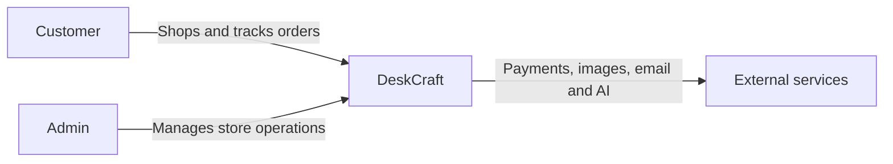
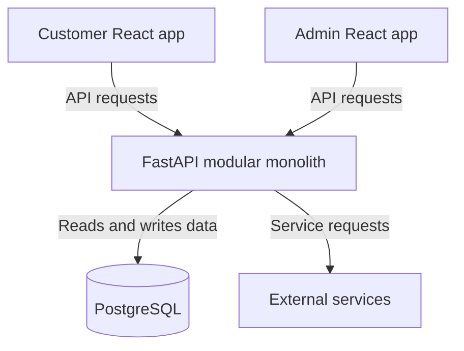

# DeskCraft Architecture Overview

**Status:** Draft  
**Date:** 28 July 2026  
**Architecture style:** Modular monolith  
**Version:** v1

## 1. Purpose

This document describes the high-level architecture of DeskCraft, including its users, system boundary, internal components, external services and backend modules.

## 2. System Overview

DeskCraft is an ergonomic workspace e-commerce platform for software developers, students, freelancers and remote workers.

The platform allows customers to discover and purchase workspace products. It also provides an admin application for managing the catalogue, inventory, orders, payments and shipments.

## 3. System Context 

### 3.1 People

- Customer --> Browses products, manages the cart, completes payments, view orders and track shipments
- Admin --> Manages Products, variants, images, inventory, order and shipment updates.

### 3.2 System Boundary

The DeskCraft system is responsible for:

- Customer and admin authentication
- Product catalogue and inventory
- Cart and address management
- Checkout and order processing
- Payment verification
- Order and shipment management
- Inventory-aware workspace recommendations

The following capabilities are provided by external services:

- Payment processing
- Product-image storage
- Email delivery
- AI response generation

### 3.3 External Systems

- Razorpay --> Processes payments in test mode
- Cloudinary --> Stores and delivers product images
- Email Service --> Sends transactional emails
- OpenAI --> Generates workspace recommendation responses

### 3.4 System Context Diagram

## 4. Internal Architecture

## 5. Component Responsibilities

- Customer React App --> Provides the customer facing shopping interface
- Admin React App --> Provides the store management service
- FastApi backend --> Applies business rules, authorizes operations and API services
- PostgreSQL --> Stores persistent application data
- External services -- > Provide payments, image storage, email delivery and AI generation

## 6. Backend Architecture

DeskCraft uses a modular-monolith backend.

This means:

- There is one FastAPI backend application.
- The backend is deployed as one unit.
- Business capabilities are separated into internal modules.
- The modules initially use one PostgreSQL database.
- DeskCraft v1 does not use microservices.

## 7. Backend Modules

### 7.1 Authentication

Responsibility:
Authenticates customers and admins and controls access to protected features.

### 7.2 Users

Responsibility:
Manages customer and admin profile information.

### 7.3 Catalogue

Responsibility:
Manages categories, products, variants and product images.

### 7.4 Inventory

Responsibility:
Tracks available quantities and stock availability for product variants.

### 7.5 Cart

Responsibility:
Manages products and quantities selected by a customer before checkout.

### 7.6 Addresses

Responsibility:
Manages customer delivery addresses and address selection during checkout.

### 7.7 Checkout

Responsibility:
Validates the cart, selected address, current prices and available inventory before payment.

### 7.7 Payments

Responsibility:
Initiates Razorpay test-mode payments and verifies payment results.

### 7.9 Orders

Responsibility:
Creates and manages customer orders after successful payment verification.

### 7.10 Shipments

Responsibility:
Stores shipment information and manages shipment-status updates within DeskCraft.

### 7.11 AI Recommendations

Responsibility:
Uses customer requirements and available inventory to recommend suitable workspace products.

## 8. Important Architecture Decisions

- AD-01 — Separate Customer and Admin Applications

DeskCraft uses separate React applications because customers and admins have different users, permissions and workflows.

- AD-02 — One FastAPI Backend

Both frontend applications communicate with one FastAPI backend so that business rules remain consistent.

- AD-03 — Modular Monolith

The backend is divided into business modules while remaining one application. This keeps v1 simpler to develop and deploy than microservices.

- AD-04 — PostgreSQL as the Source of Truth

PostgreSQL stores DeskCraft’s authoritative application data, including products, inventory, orders, payments and shipments.

- AD-05 — Backend-Controlled Business Rules

Important operations such as price calculation, stock validation, authorization and payment verification are performed by the backend.

- AD-06 — External Service Integration

DeskCraft uses external services for specialized capabilities instead of implementing payment processing, image storage, email delivery or AI generation internally.

